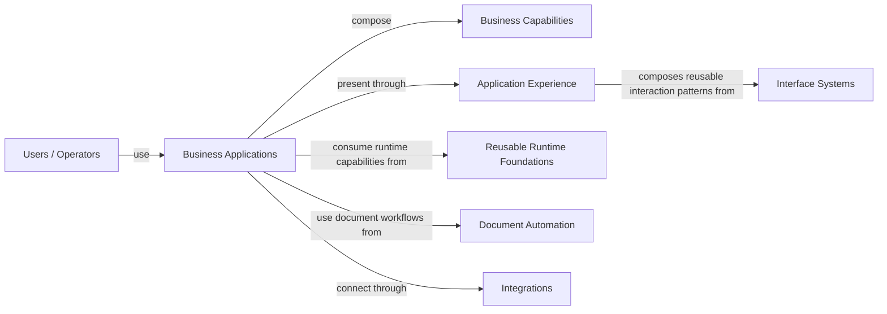

# StarChaser Framework

StarChaser Framework is a modular software ecosystem for building configurable business applications from reusable technical foundations while keeping each application in control of its own business meaning.

## What StarChaser Framework Is

StarChaser Framework explores how complex business software can be composed from explicit, independently evolving capabilities instead of rebuilding the same runtime, interface, integration, and document-processing concerns in every application.

The ecosystem separates product semantics from reusable technical foundations so applications can adopt common capabilities without forcing those foundations to know the application's domain.

## The Problem

Business applications repeatedly need the same classes of capability:

- backend and runtime infrastructure;
- provider and integration boundaries;
- data-rich interface systems;
- document and template automation;
- configurable application composition;
- structured workflows and operational behavior.

When those concerns are tightly coupled to one product, reuse becomes difficult and internal changes spread across the entire system. When they are made too generic, business meaning becomes fragmented or lost.

## The Approach

StarChaser Framework uses explicit product boundaries and consumer-to-dependency contracts. Business applications retain ownership of business concepts and workflows, while reusable foundations own technical capabilities that can remain independent from any single application.

The result is an architecture intended to support independent evolution, replaceable integrations, reusable interaction patterns, and clear responsibility boundaries.

## Core Capabilities

- configurable business application composition;
- reusable backend/runtime contracts and adapters;
- reusable application UI and interaction systems;
- provider-neutral integration boundaries;
- structured resource and workflow modeling;
- document and template inspection, generation, and processing;
- CLI, API, worker, and application execution surfaces;
- architecture and dependency-boundary validation.

## Example Use Cases

- configurable operations and work-management applications;
- internal business platforms with different enabled capability sets;
- data-heavy dashboards and administrative interfaces;
- applications that need replaceable infrastructure providers;
- document/template automation for single or bulk generation;
- reusable backend or UI foundations shared by multiple products.

## Products

### Polaris

Polaris is the business application platform. It owns business semantics, configurable resources, workflows, workspaces, permissions, provider bindings, product features, and application composition.

### Orion

Orion is the product-neutral backend and runtime foundation. It provides reusable lifecycle, HTTP, provider, persistence, identity, job/worker, observability, and runtime contracts without owning application-specific business meaning.

### Astral UI

Astral UI is the reusable application interface and interaction system. It provides primitives, components, layouts, systems, blocks, data views, editors, navigation, and other reusable presentation behavior without owning consumer business semantics.

### Docsmith

Docsmith is a standalone document and template automation product. It provides template inspection, structured document generation, CLI/API behavior, persistence and provenance, and reusable document-processing capabilities.

## High-Level Architecture

The diagram is intentionally conceptual: it shows capability relationships rather than internal repository or package topology.

## Engineering Principles

- Business meaning stays with the product that owns it.
- Reusable foundations remain independent from consumer-specific semantics.
- Dependency direction is explicit and validated.
- Provider-specific technology is isolated behind contracts where practical.
- Reusable capabilities are composed rather than duplicated.
- Durable architecture documentation is kept aligned with supported behavior.
- Security and supply-chain controls are treated as engineering constraints, not afterthoughts.

## Technologies & Engineering Areas

The ecosystem demonstrates work across TypeScript, Node.js, Vue, package/workspace architecture, HTTP APIs, CLI design, workers and jobs, persistence boundaries, provider adapters, document processing, UI systems, automated testing, CI/CD, supply-chain controls, and architecture validation.
